# Guía de Usuario — Panel de Administración Ministerio REDES

> **Versión:** 1.0  
> **Fecha:** Octubre 2026  
> **Autor:** Equipo de Desarrollo Ministerio REDES

---

## Tabla de Contenidos

1. [Introducción](#introducción)
2. [Acceso y Credenciales](#acceso-y-credenciales)
3. [Dashboard](#dashboard)
4. [Gestión de Eventos](#gestión-de-eventos)
5. [Gestión del Blog](#gestión-del-blog)
6. [Biblioteca de Media](#biblioteca-de-media)
7. [Configuración del Sitio](#configuración-del-sitio)
8. [Información del Sistema](#información-del-sistema)
9. [Atajos de Teclado](#atajos-de-teclado)
10. [Solución de Problemas](#solución-de-problemas)
11. [Preguntas Frecuentes](#preguntas-frecuentes)

---

## Introducción

### ¿Qué es el Panel de Administración?

El Panel de Administración de Ministerio REDES es una aplicación web que permite gestionar todo el contenido del sitio público (https://www.ministerioredes.org) sin necesidad de conocimientos técnicos. Desde aquí puedes:

- ✅ Crear y editar **eventos** (con flyers, fechas, ubicaciones)
- ✅ Escribir y publicar **artículos del blog** (con editor visual BlockNote)
- ✅ Subir y organizar **imágenes** en la biblioteca de media (Cloudinary)
- ✅ Configurar **textos, imágenes y estructura** de cada página del sitio
- ✅ Gestionar **enlaces de contacto y redes sociales** centralizados
- ✅ Ver el **estado técnico** del sistema

### ¿Para quién es esta guía?

- **Administradores** (acceso total): gestionan todo el contenido y configuración
- **Editores** (acceso limitado): crean y editan eventos y artículos
- **Equipo técnico**: referencia de arquitectura y endpoints

### Requisitos

- Navegador moderno: Chrome 100+, Firefox 100+, Safari 15+, Edge 100+
- Conexión a internet estable
- Credenciales válidas (ver [Acceso y Credenciales](#acceso-y-credenciales))

---

## Acceso y Credenciales

### URL de Acceso

```
https://www.ministerioredes.org/admin/login
```

### Credenciales por Rol

| Rol | Usuario | Contraseña | Permisos |
|-----|---------|------------|----------|
| **Admin Principal** | `pasmarc079` | `Excelencia079` | Acceso total: eventos, blog, media, configuración, menús, contactos |
| **Editor** | `editor` | `editor123` | Eventos y blog (crear/editar), media (subir/usar) |

### Iniciar Sesión

1. Abre https://www.ministerioredes.org/admin/login
2. Ingresa tu **usuario o email** y **contraseña**
3. Opcional: haz clic en el icono 👁 para mostrar/ocultar la contraseña
4. Pulsa **Ingresar** o `Enter`

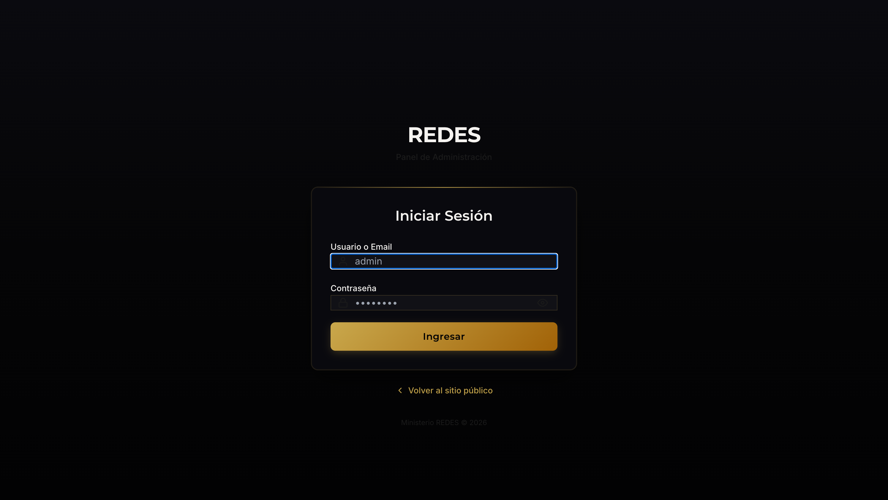

#### 📋 Ejemplo: Login como Admin Principal
| Campo | Valor a ingresar |
|-------|------------------|
| **Usuario** | `pasmarc079` |
| **Contraseña** | `Excelencia079` |
| **Resultado** | Acceso total al panel (eventos, blog, media, configuración, menús, contactos) |

#### 📋 Ejemplo: Login como Editor
| Campo | Valor a ingresar |
|-------|------------------|
| **Usuario** | `editor` |
| **Contraseña** | `editor123` |
| **Resultado** | Acceso a eventos y blog (crear/editar), media (subir/usar) |

### Cerrar Sesión

Haz clic en tu nombre de usuario (esquina superior derecha) → **Cerrar sesión**.

---

## Dashboard

### Vista General

Al iniciar sesión llegas al **Dashboard** (`/admin/dashboard`), tu centro de control:

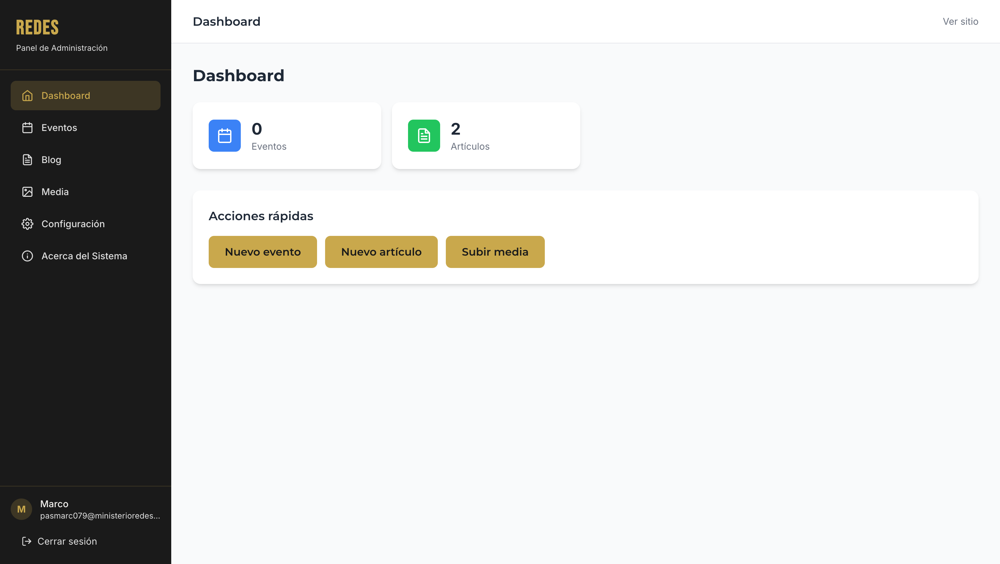

### Qué ves

- **Tarjetas de estadísticas**: total de eventos y artículos publicados
- **Acciones rápidas**: botones directos a crear contenido nuevo
- **Alertas**: si hay errores de carga, verás un aviso ámbar

### Navegación

Usa el menú lateral (o superior en móvil) para ir a:
- **Eventos** → Lista y gestión
- **Blog** → Artículos del blog
- **Media** → Biblioteca de imágenes
- **Configuración** → Páginas, menús, contactos, redes sociales
- **Sistema** → Info técnica y credenciales

---

## Gestión de Eventos

### Acceso

Menú lateral → **Eventos** → `/admin/dashboard/events`

### Lista de Eventos

La tabla muestra:

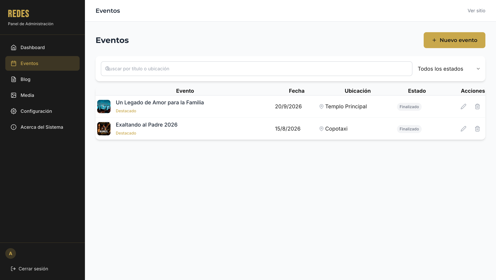

| Columna | Descripción |
|---------|-------------|
| **Evento** | Miniatura del flyer + título + badge "Destacado" |
| **Fecha** | Fecha de inicio (formato Ecuador) |
| **Ubicación** | Nombre del lugar + icono 📍 |
| **Estado** | Badge de color (ver [Estados](#estados-de-evento)) |
| **Acciones** | ✏️ Editar | 🗑️ Eliminar |

### Filtros y Búsqueda

- **Buscar**: escribe título o ubicación → filtra en tiempo real
- **Estado**: dropdown para mostrar solo Borradores, Próximos, En curso, Completados, Cancelados

### Estados de Evento (Automáticos) — **¡Importante!**

El sistema calcula el estado **solo por fechas** — **no hay campo manual de estado**:


| Estado | Color | Cuándo aplica |
|--------|-------|---------------|
| **Borrador** | Gris | Antes de la fecha de inicio, sin publicar |
| **Próximo** | Verde | Fecha futura, publicado |
| **En curso** | Azul | Hoy (entre inicio y fin) |
| **Finalizado** | Gris | Fecha pasada |
| **Cancelado** | Rojo | Marcado manualmente si se cancela |

> ℹ️ **Implicación de la fecha**: El estado se deriva **automáticamente** de `startDate`, `endDate` y la zona horaria **América/Guayaquil (UTC-5)**. Si pones una fecha pasada → "Finalizado". Si pones hoy → "En curso". Si pones futura → "Próximo". No necesitas (ni puedes) elegir el estado manualmente.

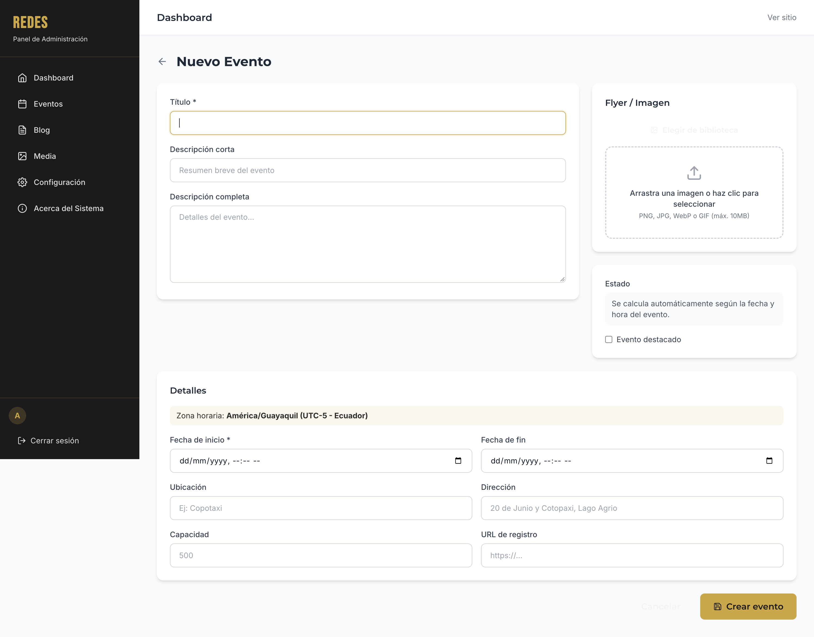

### Formulario de Evento

1. Click **[Nuevo evento]** (botón principal o en Dashboard)
2. Completa el formulario (ver [Campos del Evento](#campos-del-evento))
3. Sube **flyer** (arrastra o elige de biblioteca)
4. Pulsa **[Crear evento]**


#### 📋 Ejemplo completo: Crear evento "Exaltando al Padre 2026"
| Paso | Campo | Valor de ejemplo | Notas |
|------|-------|------------------|-------|
| 1 | **Título** | `Exaltando al Padre 2026` | Obligatorio |
| 2 | **Descripción corta** | `Noche de adoración que transforma` | Para listados |
| 3 | **Descripción completa** | Texto largo con detalles del evento | Área de texto |
| 4 | **Fecha inicio** | `2026-08-15T19:00` | **Obligatorio** - zona UTC-5 |
| 5 | **Fecha fin** | `2026-08-15T22:00` | Opcional |
| 6 | **Ubicación** | `Copotaxi` | Nombre corto |
| 7 | **Dirección** | `20 de Junio y Cotopaxi, Lago Agrio, Ecuador` | Para Google Maps |
| 8 | **Capacidad** | `500` | Número entero |
| 9 | **URL registro** | `https://forms.gle/...` | Opcional |
| 10 | **Flyer** | Arrastra `flyer-exaltando.jpg` | Se sube a Cloudinary |
| 11 | **Destacado** | ✓ Checkbox | Aparece en carrusel Inicio |
| 12 | **Guardar** | Click **[Crear evento]** | Estado se calcula solo por fecha |

#### ⚠️ Errores comunes con fechas
| Error | Causa | Solución |
|-------|-------|----------|
| Evento no aparece en "Próximos" | Fecha inicio pasada | Usa fecha futura (zona UTC-5) |
| Estado "Finalizado" inesperado | Fecha fin en el pasado | Deja fecha fin vacía o futura |
| Zona horaria incorrecta | Navegador en otra zona | El sistema usa UTC-5 (Ecuador) siempre |

### Editar Evento

1. En la lista, click ✏️ **Editar** en la fila del evento
2. Modifica los campos necesarios
3. Pulsa **[Actualizar]**

### Eliminar Evento

1. Click 🗑️ **Eliminar** → confirma en el modal
2. ⚠️ **Irreversible**: el evento y su flyer se borran definitivamente

### Campos del Evento

| Campo | Obligatorio | Descripción |
|-------|-------------|-------------|
| **Título** | ✅ | Nombre del evento (ej: "Exaltando al Padre 2026") |
| **Descripción corta** | | Resumen para listados (máx. 200 chars) |
| **Descripción completa** | | Texto largo con detalles |
| **Fecha inicio** | ✅ | Fecha/hora (zona: América/Guayaquil UTC-5) |
| **Fecha fin** | | Opcional, para eventos de varios días |
| **Ubicación** | | Nombre corto (ej: "Copotaxi") |
| **Dirección** | | Dirección completa para Google Maps |
| **Capacidad** | | Número entero (ej: 500) |
| **URL de registro** | | Enlace a formulario externo (opcional) |
| **Flyer/Imagen** | | Sube o elige de biblioteca (Cloudinary) |
| **Destacado** | | Checkbox: muestra en carrusel de Inicio |

---

## Gestión del Blog

### Acceso

Menú lateral → **Blog** → `/admin/dashboard/blog`

### Lista de Artículos

Tabla con columnas:

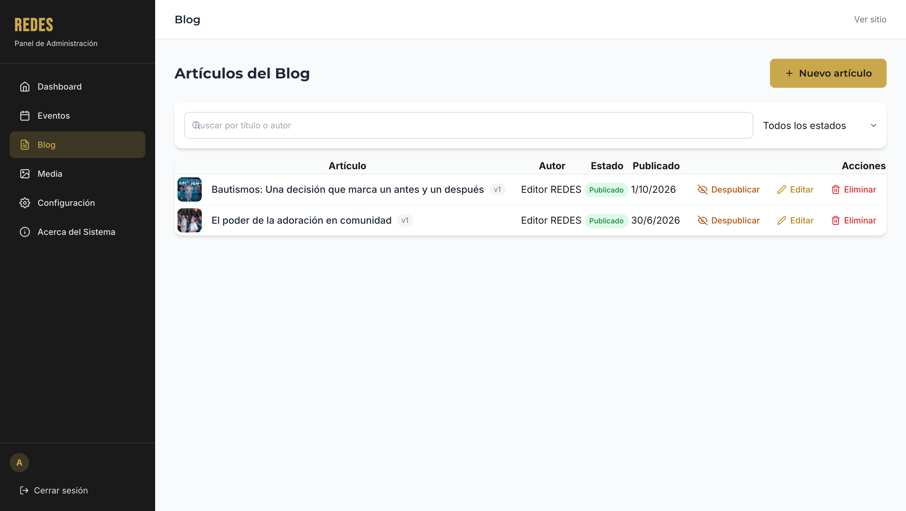

| Columna | Descripción |
|---------|-------------|
| **Artículo** | Miniatura portada + título + versión (v1, v2...) |
| **Autor** | Nombre completo del autor |
| **Estado** | 🟢 Publicado / ⚪ Borrador |
| **Publicado** | Fecha de publicación o "—" |
| **Acciones** | 🌐 Publicar/Despublicar | ✏️ Editar | 🗑️ Eliminar |

### Filtros

- **Buscar**: por título o nombre de autor
- **Estado**: Todos / Publicados / Borradores

### Crear Nuevo Artículo

1. Click **[Nuevo artículo]**
2. Completa el formulario (ver [Campos del Artículo](#campos-del-artículo))
3. Escribe contenido en el **editor BlockNote** (estilo Notion)
4. Sube **imagen de portada**
5. Añade **etiquetas** (tags)
6. Completa **SEO** (título y descripción para Google)
7. **[Guardar borrador]** o **[Publicar artículo]**


#### 📋 Ejemplo completo: Crear artículo "El poder de la oración en familia"
| Paso | Acción | Valor de ejemplo |
|------|--------|------------------|
| 1 | **Título** | `El poder de la oración en familia` |
| 2 | **Extracto** | `Descubre cómo la oración transforma los hogares y fortalece los lazos familiares.` |
| 3 | **Contenido (editor)** | Escribe párrafos, usa `/h2` para subtítulos, `/imagen` para insertar fotos, `/media` para bloques imagen+texto |
| 4 | **Imagen de portada** | Click área punteada → elige de Media Library → `portada-oracion-familia.jpg` |
| 5 | **Etiquetas** | Click chips: `Oración`, `Familia`, `Fe` |
| 6 | **SEO Título** | `El Poder de la Oración en Familia | Ministerio REDES` (contador: 52/60) |
| 7 | **SEO Descripción** | `Aprende cómo la oración diaria transforma hogares. Guía práctica para familias cristianas.` (156/160) |
| 8 | **Guardar** | Click **[Guardar borrador]** → queda en estado "Borrador" |
| 9 | **Publicar** | Cuando esté listo, click **[Publicar artículo]** → pasa a verde "Publicado" |

#### 📋 Ejemplo: Añadir imágenes al artículo
| Método | Cómo hacerlo |
|--------|--------------|
| **Desde editor (recomendado)** | En editor BlockNote: escribe `/imagen` → click "Elegir de biblioteca" → selecciona foto → se inserta en el contenido |
| **Arrastrar y soltar** | Arrastra archivo JPG/PNG/WebP directo al editor → se sube a Cloudinary y se inserta |
| **Portada** | En sidebar derecho: click área punteada "Imagen de portada" → elige de Media Library |

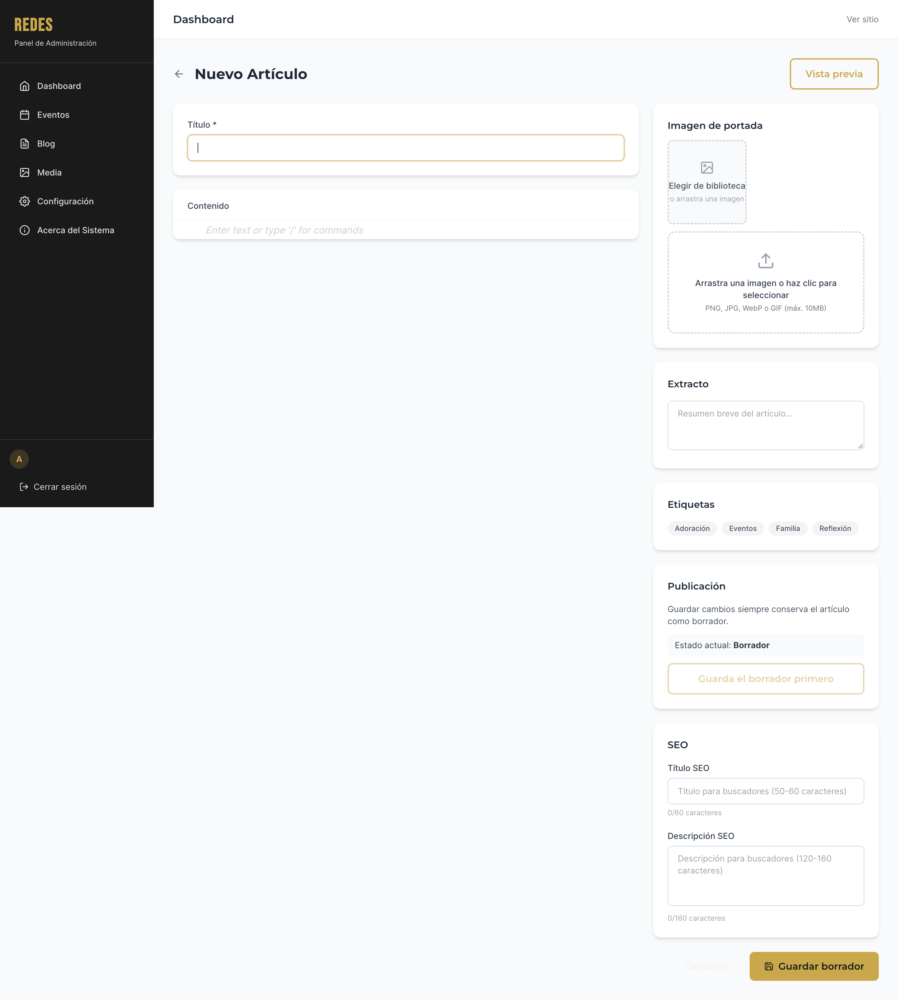

#### 📋 Ejemplo: Añadir etiquetas (Tags)
1. En sidebar derecho, sección **Etiquetas**
2. Click en chips disponibles: `Oración`, `Familia`, `Fe`, `Eventos`, `Reflexión`
3. Los seleccionados se marcan en **dorado** (bg-gold text-dark)
4. Para quitar: click de nuevo en el chip

### Editor BlockNote (WYSIWYG)

El editor permite escribir como en Notion:

| Acción | Cómo hacerlo |
|--------|--------------|
| **Escribir texto** | Simplemente escribe |
| **Encabezados** | Escribe `/h1`, `/h2`, `/h3` o usa `# `, `## `, `### ` |
| **Lista viñetas** | `- ` o `* ` al inicio de línea |
| **Lista numerada** | `1. ` al inicio |
| **Cita** | `> ` al inicio |
| **Código** | `` `código` `` o bloque con triple backtick |
| **Separador** | `---` en línea sola |
| **Imagen** | Arrastra archivo o `/imagen` → elige de biblioteca |
| **Media + Texto** | `/media` → bloque de 2 columnas (imagen + texto) |
| **YouTube** | `/youtube` → pega URL del video |

**Barra flotante**: selecciona texto → aparece barra con negrita, cursiva, enlace, código, etc.


#### 📋 Ejemplo completo: Crear artículo "El poder de la oración en familia"
| Paso | Acción | Valor de ejemplo |
|------|--------|------------------|
| 1 | **Título** | `El poder de la oración en familia` |
| 2 | **Extracto** | `Descubre cómo la oración transforma los hogares y fortalece los lazos familiares.` |
| 3 | **Contenido (editor)** | Escribe párrafos, usa `/h2` para subtítulos, `/imagen` para insertar fotos, `/media` para bloques imagen+texto |
| 4 | **Imagen de portada** | Click área punteada → elige de Media Library → `portada-oracion-familia.jpg` |
| 5 | **Etiquetas** | Click chips: `Oración`, `Familia`, `Fe` |
| 6 | **SEO Título** | `El Poder de la Oración en Familia | Ministerio REDES` (contador: 52/60) |
| 7 | **SEO Descripción** | `Aprende cómo la oración diaria transforma hogares. Guía práctica para familias cristianas.` (156/160) |
| 8 | **Guardar** | Click **[Guardar borrador]** → queda en estado "Borrador" |
| 9 | **Publicar** | Cuando esté listo, click **[Publicar artículo]** → pasa a verde "Publicado" |

#### 📋 Ejemplo: Añadir imágenes al artículo
| Método | Cómo hacerlo |
|--------|--------------|
| **Desde editor (recomendado)** | En editor BlockNote: escribe `/imagen` → click "Elegir de biblioteca" → selecciona foto → se inserta en el contenido |
| **Arrastrar y soltar** | Arrastra archivo JPG/PNG/WebP directo al editor → se sube a Cloudinary y se inserta |
| **Portada** | En sidebar derecho: click área punteada "Imagen de portada" → elige de Media Library |


#### 📋 Ejemplo: Añadir etiquetas (Tags)
1. En sidebar derecho, sección **Etiquetas**
2. Click en chips disponibles: `Oración`, `Familia`, `Fe`, `Eventos`, `Reflexión`
3. Los seleccionados se marcan en **dorado** (bg-gold text-dark)
4. Para quitar: click de nuevo en el chip

### Editor BlockNote (WYSIWYG)

El editor permite escribir como en Notion:

| Acción | Cómo hacerlo |
|--------|--------------|
| **Escribir texto** | Simplemente escribe |
| **Encabezados** | Escribe `/h1`, `/h2`, `/h3` o usa `# `, `## `, `### ` |
| **Lista viñetas** | `- ` o `* ` al inicio de línea |
| **Lista numerada** | `1. ` al inicio |
| **Cita** | `> ` al inicio |
| **Código** | `` `código` `` o bloque con triple backtick |
| **Separador** | `---` en línea sola |
| **Imagen** | Arrastra archivo o `/imagen` → elige de biblioteca |
| **Media + Texto** | `/media` → bloque de 2 columnas (imagen + texto) |
| **YouTube** | `/youtube` → pega URL del video |

**Barra flotante**: selecciona texto → aparece barra con negrita, cursiva, enlace, código, etc.


### Publicar / Despublicar

- **Publicar**: botón 🌐 **Publicar** (solo en borradores) → pasa a verde "Publicado"
- **Despublicar**: botón 🙈 **Despublicar** → vuelve a borrador
- **Guardar borrador**: siempre guarda como borrador (no publica)

### Versiones

Cada vez que guardas se crea una **versión** (v1, v2, v3...). El sistema muestra la versión actual en la lista.

### Campos del Artículo

| Campo | Obligatorio | Descripción |
|-------|-------------|-------------|
| **Título** | ✅ | Título principal (máx. 120 chars) |
| **Extracto** | | Resumen para listados y SEO (máx. 300 chars) |
| **Contenido** | ✅ | Editor BlockNote (ver arriba) |
| **Imagen de portada** | | Imagen 16:9 para lista y cabecera |
| **Etiquetas (Tags)** | | Click en chips para añadir/quitar |
| **Estado** | | Borrador / Publicado (automático al publicar) |
| **SEO Título** | | Título para Google (50-60 chars, contador en vivo) |
| **SEO Descripción** | | Meta description (120-160 chars, contador en vivo) |

### Vista Previa

Click **[Vista previa]** → modal con renderizado real del artículo (título, portada, extracto, contenido HTML).

---

## Biblioteca de Media

### Acceso

Menú lateral → **Media** → `/admin/dashboard/media`

### Qué es

Almacén central de **todas las imágenes** del sitio (Cloudinary). Aquí subes, organizas y reutilizas fotos para eventos, blog y páginas.

### Interfaz


### Subir Imágenes

1. Click **[Subir archivos]** o arrastra archivos al área punteada
2. Opcional: escribe **etiqueta** (ej: "eventos-2026", "pastor")
3. Espera barra de progreso → aparece en la galería

**Formatos**: JPG, PNG, WebP, GIF, SVG  
**Tamaño máx.**: 10 MB por archivo  
**Optimización**: Cloudinary convierte a WebP, genera thumbnails y versión `medium` automáticamente

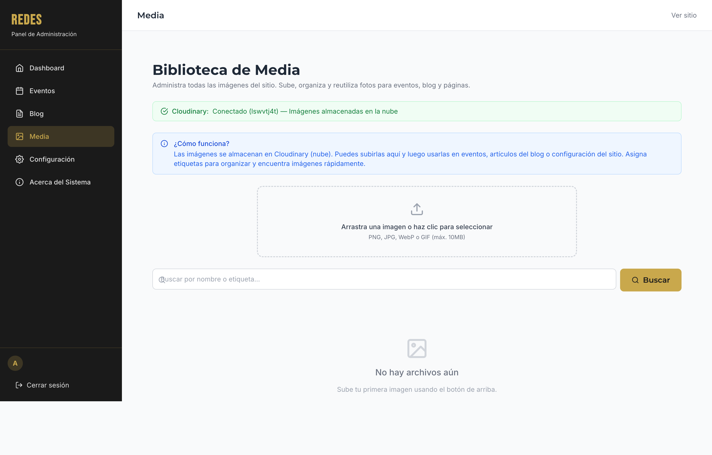

#### 📋 Ejemplo: Subir foto para evento
1. Click **[Subir archivos]** → selecciona `flyer-exaltando-2026.jpg`
2. En campo **Etiqueta**: escribe `eventos-2026`
3. Click **[Subir]** → barra de progreso → aparece en galería
4. Click ℹ️ **Ver usos** → verás "evento: Exaltando 2026" si ya la asignaste

### Buscar y Filtrar

- Escribe en **Buscar...** + Enter → filtra por nombre de archivo o etiqueta
- Click **X** en el input para limpiar búsqueda

### Acciones por Imagen (hover en tarjeta)

| Icono | Acción |
|-------|--------|
| 📋 **Copiar** | Copia URL original al portapapeles |
| ℹ️ **Ver usos** | Muestra dónde se usa (eventos, blog, páginas) |
| 🗑️ **Eliminar** | Borra de Cloudinary y base de datos (confirma modal) |

### Etiquetas (Labels)

1. Click en **" + Agregar etiqueta"** o etiqueta existente
2. Escribe nombre (ej: "navidad-2025") → Enter para guardar
3. Sirve para **filtrar y organizar** (no visible en público)

### Ver Usos

Click ℹ️ → badge verde muestra: "evento: Exaltando 2026", "blog: Artículo X", "página: Inicio", etc.

### Eliminar Imagen

1. Click 🗑️ → modal de confirmación
2. Si tiene **usos detectados**, el modal avisa: *"Este archivo se usa en: evento: X, blog: Y"*
3. Confirma → elimina de Cloudinary y BD

> ⚠️ **Cuidado**: si eliminas una imagen en uso, se romperá en el sitio público. Verifica usos antes de borrar.

---

## Configuración del Sitio

### Acceso

Menú lateral → **Configuración** → `/admin/dashboard/settings`

Dos pestañas principales:

1. **Configuración de Páginas** — textos, imágenes, orden del menú
2. **Enlaces Externos y Contacto** — datos institucionales, redes sociales

---

### Pestaña 1: Configuración de Páginas

#### Orden del Menú (Header)

- **Drag & Drop**: arrastra el icono ☰ (6 puntos) para reordenar
- **Flechas ↑↓**: sube/baja una posición
- **Checkbox "Visible en menú"**: oculta/muestra en header sin borrar
- **Botón [Guardar orden del menú]**: confirma cambios

#### Editar Contenido de Página

1. Click **[Editar Contenido]** en la fila de la página
2. Se abre **modal lateral** (derecha) con todos los campos editables
3. Modifica textos, imágenes, booleanos
4. Click **[Guardar cambios]**

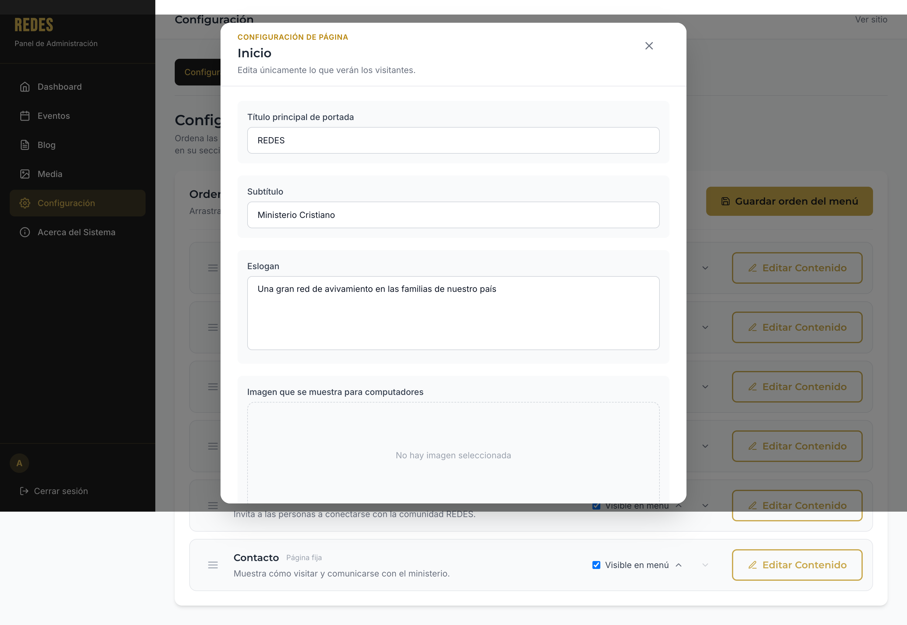

#### 📋 Ejemplo: Cambiar el título hero de Inicio
1. **Configuración** → **Configuración de Páginas**
2. En fila **Inicio**, click **[Editar Contenido]**
3. En modal, busca campo **Título principal de portada** (key: `hero_title`)
4. Cambia valor a: `REDES - Avivamiento Familiar`
5. Click **[Guardar cambios]** → el hero de la home pública se actualiza al instante

#### Páginas y sus Campos

| Página | URL | Campos Principales |
|--------|-----|-------------------|
| **Inicio** | `/` | Título hero, subtítulo, eslogan, imágenes hero (desktop/mobile), mostrar redes |
| **Nosotros** | `/nosotros` | Título, imágenes portada, historia, misión, visión, foto pastor |
| **Eventos** | `/eventos` | Título, descripción, imágenes portada |
| **Blog** | `/blog` | Título, descripción, imágenes portada |
| **Comunidad** | `/comunidad` | Título, descripción, imágenes portada |
| **Contacto** | `/contacto` | Mensaje bienvenida, imágenes portada |

#### Tipos de Campo

| Tipo | UI | Ejemplo |
|------|-----|---------|
| **text** | Input línea única | Título, eslogan |
| **textarea** | Área de texto (5 líneas) | Historia, misión, descripción |
| **image** | Vista previa + [Elegir de biblioteca] / [Quitar] | Hero, portada, foto pastor |
| **boolean** | Checkbox | "Mostrar sección Nuestras Redes" |

#### Imágenes en Páginas

- Cada página tiene **2 campos de imagen**: `*_url` (desktop) y `*_mobile_url` (móvil)
- Click **[Elegir de biblioteca]** → selecciona de Media Library
- Click **[Quitar imagen]** → deja campo vacío

---

### Pestaña 2: Enlaces Externos y Contacto

#### Redes Sociales Centralizadas

Una sola tabla para **todas las redes** (se usan en Inicio, Comunidad, Footer):

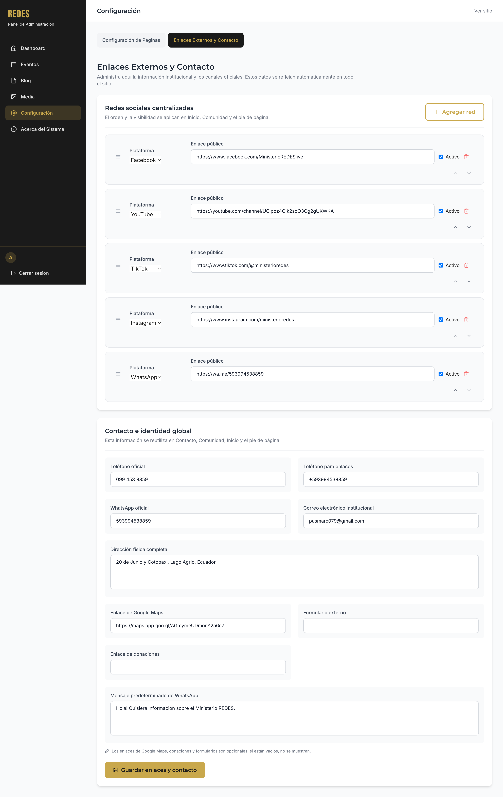

| Campo | Descripción |
|-------|-------------|
| **Plataforma** | Dropdown: Facebook, YouTube, TikTok, Instagram, WhatsApp, X/Twitter, Telegram |
| **Enlace público** | URL completa (ej: `https://facebook.com/MinisterioREDESlive`) |
| **Activo** | Checkbox: muestra/oculta en todo el sitio |
| **Orden** | Flechas ↑↓ o drag & drop (ícono ☰) |
| **Eliminar** | 🗑️ borra la fila |

Click **[Agregar red]** → nueva fila al final.

#### 📋 Ejemplo: Cambiar el enlace de Facebook
1. Ve a **Configuración** → **Enlaces Externos y Contacto** → sección **Redes sociales centralizadas**
2. Busca la fila donde **Plataforma = Facebook**
3. En **Enlace público**, reemplaza la URL actual por la nueva: `https://facebook.com/NuevaPaginaREDES`
4. Verifica que **Activo** esté marcado ✓
5. Click **[Guardar enlaces y contacto]** al final de la página
6. **Resultado**: El icono de Facebook en Inicio, Comunidad y Footer ahora apunta a la nueva página

#### 📋 Ejemplo: Cambiar el enlace de YouTube
1. En la misma tabla, busca **Plataforma = YouTube**
2. En **Enlace público**, pon tu canal: `https://youtube.com/@MinisterioREDESoficial`
3. Marca **Activo** ✓ si quieres que se muestre
4. Click **[Guardar enlaces y contacto]**
5. **Resultado**: El botón de YouTube en el sitio público abre tu canal directamente

#### 📋 Ejemplo: Agregar TikTok (si no existe)
1. Click **[Agregar red]** → aparece fila nueva al final
2. **Plataforma**: selecciona `TikTok` del dropdown
3. **Enlace público**: `https://tiktok.com/@ministerioredes`
4. **Activo**: ✓
5. Usa flechas ↑↓ para ponerlo en orden deseado
6. Click **[Guardar enlaces y contacto]**

#### Contacto e Identidad Global

Campos que se **reutilizan automáticamente** en Contacto, Comunidad, Inicio, Footer:

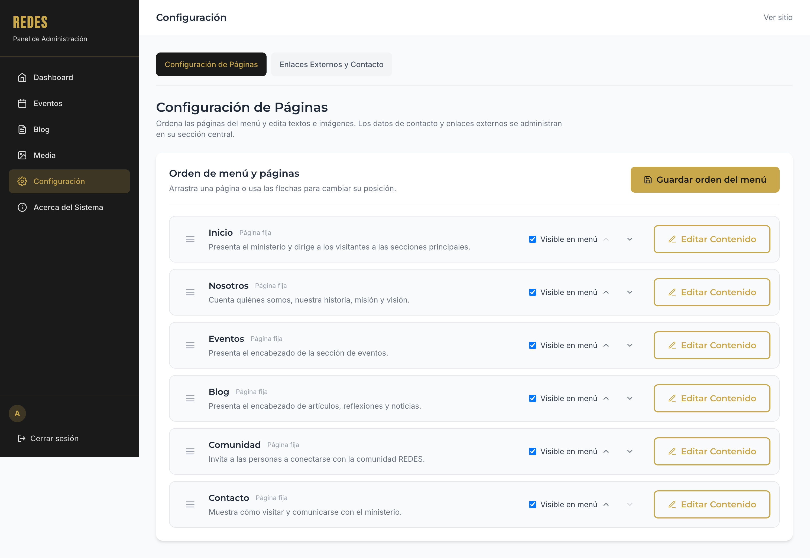

| Campo | Tipo | Ejemplo |
|-------|------|---------|
| **Teléfono oficial** | text | `099 453 8859` |
| **Teléfono para enlaces** | text | `+593994538859` (formato `wa.me/...`) |
| **WhatsApp oficial** | text | `593994538859` (solo números) |
| **Correo institucional** | email | `ministeriocristianoredes@gmail.com` |
| **Dirección física** | textarea | `20 de Junio y Cotopaxi, Lago Agrio, Ecuador` |
| **Google Maps URL** | url | `https://maps.app.goo.gl/...` |
| **Enlace de donaciones** | url | `https://donar.ejemplo.com` (opcional) |
| **Formulario externo** | url | `https://forms.ejemplo.com` (opcional) |
| **Mensaje WhatsApp predeterminado** | textarea | `Hola! Quisiera información...` |

Click **[Guardar enlaces y contacto]** al final.

---

## Información del Sistema

### Acceso

Menú lateral → **Sistema** → `/admin/dashboard/system`

### Qué ves

Solo lectura — documentación técnica:

1. **Arquitectura General**: 3 tarjetas (Frontend, Admin, Backend) con puertos y tecnologías
2. **Tecnologías Utilizadas**: 6 categorías (Frontend, Admin, Backend, BD, Cloud, Seguridad) con lista de librerías
3. **Endpoints Principales**: tabla con método (GET/POST/PUT/DELETE), ruta, descripción
4. **Credenciales de Desarrollo**: usuario/contraseña de admin y editor (ver [Acceso](#acceso-y-credenciales))

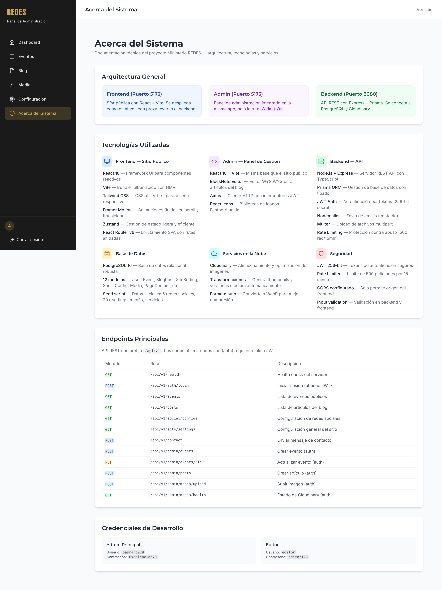

### Para qué sirve

- Referencia rápida para equipo técnico
- Verificar estado de Cloudinary (badge verde/rojo en Media)
- Consultar endpoints API si necesitas integraciones

---

## Atajos de Teclado

| Acción | Atajo |
|--------|-------|
| **Guardar formulario** | `Ctrl/Cmd + S` (en editores) |
| **Buscar en listas** | `Ctrl/Cmd + F` → foco en input de búsqueda |
| **Navegar tabs** | `Tab` / `Shift + Tab` |
| **Abrir/cerrar modales** | `Escape` cierra |
| **Submit login** | `Enter` en cualquier campo |
| **Editor BlockNote** | `/` → menú slash commands |

---

## Solución de Problemas

### No puedo iniciar sesión

| Causa | Solución |
|-------|----------|
| Credenciales incorrectas | Verifica usuario/contraseña (distingue mayúsculas) |
| Token expirado | Cierra pestaña, abre de nuevo y reintenta |
| Error de red | Verifica conexión; si persiste, contacta a técnico |

### La imagen no se ve en el sitio público

1. Ve a **Media** → busca la imagen → click ℹ️ **Ver usos**
2. Si dice "Sin uso detectado", no está asignada
3. Ve a la página/evento/artículo → edita → elige la imagen de la biblioteca
4. Guarda cambios

### El menú no muestra mi página nueva

1. **Configuración** → **Configuración de Páginas**
2. Verifica que la página tenga **checkbox "Visible en menú" ✓**
3. Click **[Guardar orden del menú]**
4. Recarga el sitio público (`Ctrl + F5`)

### El evento no aparece en "Próximos"

- Verifica **Fecha de inicio** (debe ser futura)
- Verifica que **no esté en Borrador** (el estado es automático por fecha)
- Zona horaria: **América/Guayaquil (UTC-5)**

### Error "Cloudinary credentials not configured"

Contacta al técnico: faltan variables de entorno en el backend (`CLOUDINARY_CLOUD_NAME`, `CLOUDINARY_API_KEY`, `CLOUDINARY_API_SECRET`).

### El editor BlockNote va lento

- Imágenes muy grandes → usa versión `medium` de Cloudinary (auto)
- Demasiados bloques → divide en varios artículos
- Limpia caché del navegador (`Ctrl + Shift + R`)

---

## Preguntas Frecuentes

### 📝 **¿Puedo editar el HTML directamente?**
No. El editor BlockNote genera HTML limpio y seguro. Para HTML personalizado, contacta al equipo técnico.

### 🖼️ **¿Qué tamaño de imagen recomiendan?**
- **Flyers eventos**: 1200×628 px (ratio 1.91:1)
- **Portadas blog**: 1920×1080 px (16:9)
- **Hero páginas**: 1920×800 px (desktop) / 800×1200 px (mobile)
- **Máx. 10 MB** por archivo

### 🔗 **¿Cómo añado un enlace al menú que no sea una página?**
Actualmente el menú solo acepta páginas del sistema. Para enlaces externos, usa la sección **Enlaces Externos y Contacto** (se muestran en Footer y Comunidad).

### 👥 **¿Puedo crear más usuarios admin?**
No desde la UI. Requiere script de seed en backend. Contacta al técnico.

### 🌐 **¿El sitio soporta idiomas?**
Actualmente solo **español (Ecuador)**. Para multilenguaje se requiere desarrollo adicional.

### 📱 **¿Se ve bien en móvil?**
Sí, todo es **responsive** (mobile-first). Prueba en Chrome DevTools (`F12` → `Ctrl+Shift+M`).

### 🔒 **¿Hay logs de auditoría?**
No implementado aún. Los cambios de contenido no dejan rastro de quién/qué/cuándo. Para auditoría, contacta al técnico.

### ☁️ **¿Dónde se guardan las imágenes?**
En **Cloudinary** (nube). La biblioteca Media es solo interfaz; los archivos no están en tu servidor.

### 🔄 **¿Hay respaldo automático?**
La base de datos (PostgreSQL en Seenode) tiene backups automáticos diarios. Las imágenes en Cloudinary tienen redundancia propia.

---

## Contacto y Soporte

| Canal | Detalle |
|-------|---------|
| **Equipo técnico** | `pasmarc079@gmail.com` |
| **Errores críticos** | Captura de pantalla + pasos para reproducir → email |
| **Mejoras / sugerencias** | Documenta el caso de uso y envía por email |

---

## Historial de Cambios

| Versión | Fecha | Cambios |
|---------|-------|---------|
| 1.0 | Oct 2026 | Guía inicial completa |

---

> **Nota**: Esta guía refleja el estado del panel al **Octubre 2026**. Tras actualizaciones, algunas capturas o pasos pueden variar. La versión más reciente siempre está en el repositorio del proyecto.